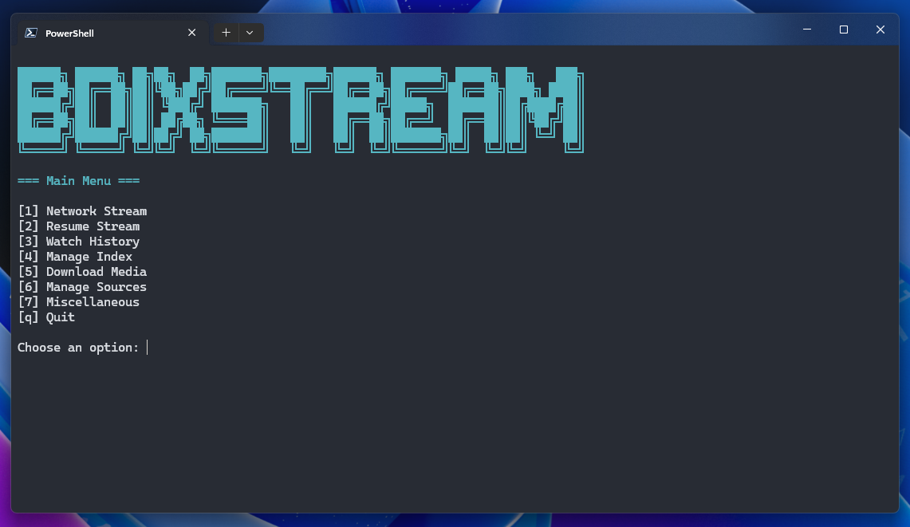

# BDIXStream



BDIXStream is a simple tool for PowerShell that helps you find and play media from online directories. It lets you search for videos, stream them with your favorite player, download files, and keep track of what you've watched. It's like a personal media browser for web folders.

## What You Need

- PowerShell 7 (pwsh) – it's free and needs to be installed.
- A few extra tools: fzf (for searching), aria2c (for downloading), jq (for handling data), and mpv (for streaming).

## How to Install

1. Open Command Prompt or PowerShell (search for "cmd" or "powershell" in Start menu).
2. Install PowerShell 7 and the other tools using this command:

   ```
   winget install --id Microsoft.PowerShell -e; winget install --id Microsoft.WindowsTerminal -e; winget install --id jqlang.jq -e; winget install --id aria2.aria2 -e; winget install --id junegunn.fzf -e; winget install --id MPV-Player.MPV -e
   ```

3. Download or copy the BDIXStream folder to your computer.

That's it! If something doesn't install, try restarting your computer.

## Getting Started

1. Open Windows Terminal (search for "wt" in Start menu).
2. Go to the BDIXStream folder (type `cd C:\path\to\bdix-stream` and press Enter).
3. Run the script by typing:

   ```
   pwsh -ExecutionPolicy Bypass -File .\main.ps1
   ```

The first time, it will create a settings file. You can change things like where downloads go or which player to use. Here's the default config:

```json
{
   "DownloadPath": "$PSScriptRoot\\downloads",
   "MediaPlayer": "mpv",
   "MediaPlayerFlags": [
      "--save-position-on-quit",
      "--watch-later-options=start,volume,mute"
   ],
   "VideoExtensions": [".mp4", ".mkv", ".avi", ".mov", ".flv", ".webm", ".m4v"],
   "DirBlockList": ["lost found", "software", "games", "e book", "ebooks"],
   "Tools": {
      "fzf": "",
      "aria2c": "",
      "jq": "",
      "edit": ""
   }
}
```

### Create a Shortcut

To make it easier, create a desktop shortcut:

1. Right-click on your desktop and choose **New > Shortcut**.
2. In the location box, type:

   ```
   wt.exe pwsh.exe -ExecutionPolicy Bypass -File "C:\path\to\bdix-stream\main.ps1"
   ```

   (Replace `C:\path\to\bdix-stream` with your actual folder path.)

3. Click Next, name it "BDIXStream", and Finish.

Double-click the shortcut to start the script anytime.

## Using the Script

The script has a simple menu. Use the number keys or letters to choose:

- **[1] Network Stream**: Search and play videos online from your indexed sources.
- **[2] Resume Stream**: Quickly resume the last video you watched.
- **[3] Watch History**: Browse and replay your watch history.
- **[4] Manage Index**: Build, update, or selectively index media sources.
  - Build Index: Create a fresh index of all configured sources.
  - Update Index: Incrementally update existing index with changes.
  - Selective Index: Index only specific sources you choose.
  - Prune Index: Remove dead links from the index.
- **[5] Download Media**: Search and download videos to your computer.
- **[6] Manage Sources**: Add new sources or remove existing ones.
  - Add Source: Add new H5ai or Apache directory servers.
  - Source Explorer: Browse and discover directories without indexing.
  - Remove Sources: Remove sources from your list.
  - Purge Sources: Remove inaccessible sources automatically.
- **[7] Miscellaneous**: Manage files, backups, and logs.
  - Current Files: View, remove, or backup settings and data files.
  - Backup Files: View, remove, or restore backup files.
  - Log Files: View or remove log files.
- **[q] Quit**: Exit the application.

Type to search, press Enter to select, and 'b' to go back or 'q' to quit.

## Help

- If it says a tool is missing, make sure you installed everything from the install step.
- No videos showing? Go to "Manage Index → Build Index" first to scan your sources.
- Want to add sources? Use "Source Explorer" to browse directories and add them.
- Playback not resuming? Check that `MediaPlayerFlags` is set in your settings.json.
- Slow indexing? Use "Update Index" instead of rebuilding from scratch.
- Need to stream from backups? Go to "Miscellaneous → Backup Files → View Files" and select a crawler-state backup.

**Performance Tips**:
- Use "Update Index" for quick updates instead of full rebuilds
- Use "Selective Index" to index only specific sources
- The script saves progress during indexing - you can safely resume if interrupted
- Empty directories are automatically tracked and skipped

## Support

If you run into any problems or have suggestions, please report them on the GitHub page.

If you like this tool, consider buying me a coffee.

<a href="https://www.buymeacoffee.com/fahim.ahmed" target="_blank">
  
</a>

